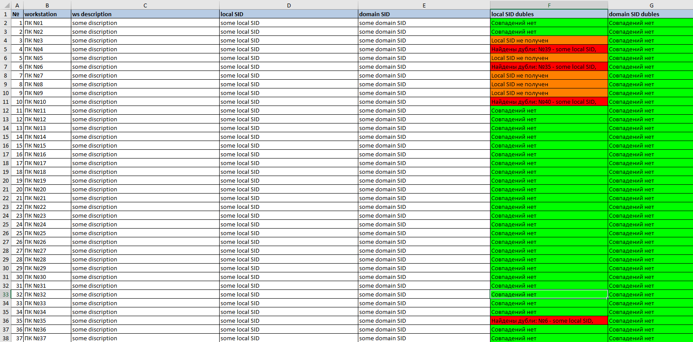

# dublicate_SIDs_check
 Script for looking for dublicate SIDs in local web at domain's workstations

С помощью этого скрипта можно просканировать свою локальную сеть на предмет наличия дублирующихся локальных и доменных SID.

В директории с утилитой должен находиться файл выгрузки имен компьютеров из Active Directory
с именем "workstations.txt" (без правок содержимого).

Вывод будет произведен в сгенерированную таблицу "compare_sids.xlsx".
____________________________________

ВАЖНО! Для удаленного получения SID компьютеров домена нужно поместить
утилиту psgetsid.exe из набора системных утилит PsTools по следующему пути:

C:/PsTools/psgetsid.exe

Также скрипт нужно запускать от имени администратора.
____________________________________

Screenshots:
 

